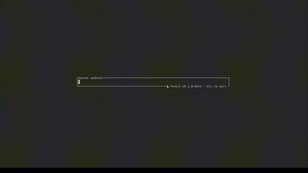

# 🦜 Toutui: A TUI Audiobookshelf Client for Linux  
🚀 **Experience the power of Audiobookshelf in your terminal!**  

  

## ✨ Features  
✅ **Lightweight & Fast** – A minimalist, terminal-based UI (TUI)  
✅ **Supports Books & Podcasts** – Enjoy both audiobooks and podcasts  
✅ **Sync Progress & Stats** – Keep your listening progress in sync  
✅ **Streaming Support** – Play directly without downloading  

TODO : CONFIG file + option cvlc

## 🔮 Future Features  
🚧 **Check the TODO list for upcoming improvements.**  

## ⚠️ Caution: Beta Version  
This app is still in beta and may contain bugs.  
If you encounter any issues that are **not yet listed** in the Issues section or the here, please **open a new issue** to report them.  

🔐 You can use this app with **minimal risk** to your Audiobookshelf library.  
At worst, you may experience **sync issues**, but there is **no risk** of data loss, deletion, or irreversible changes (API is just used to retrieve books and sync them).

## 🚨 Installation Instructions

**⚠️ If you follow all the instructions but installation fails, please open an issue.**

### For Arch Users
TODO

### Git
(The install and update process will soon be easier thanks to a script.)

#### **Requirements:**
- `Rust`
- `VLC`
- `SQLite3`
- `libssl-dev`
- `Your terminal must support emojis`
- Optional, only if you use cvlc:
- `Netcat`
- `Kitty terminal emulator`

#### **Install:**
- `git pull https://github.com/AlbanDAVID/Toutui`
- `cd Toutui/`
- `mkdir -p ~/.config/toutui`
- Token encryption in the database (NOTE: replace `secret`):
- `echo 'TOUTUI_SECRET_KEY=secret' >> ~/.config/toutui/.env`
- `cp config.example.toml ~/.config/toutui/config.toml`
- `cargo run --release`
- To find the binary: `cd /target/release` (`./Toutui` to exec)

#### After installation, you will have the following files in `~/.config/toutui`:
- `.env` — Contains the secret key.
- `config.toml` — Configuration file.
- `toutui.log` — Log file.
- `db.sqlite3` — SQLite database file.

#### **Update:**

When a new release is available, follow these steps:

- `git pull https://github.com/AlbanDAVID/Toutui`
- `cargo run --release`
- If any, others update instructions will be added here

